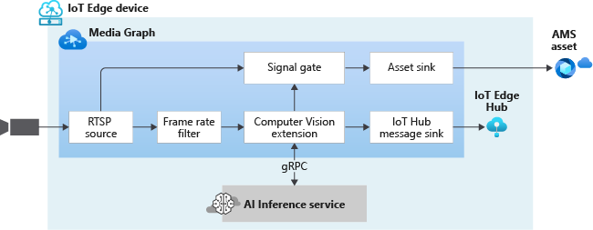

# Analyzing Live Video with Computer Vision for Spatial Analysis

The video from an RTSP-capable camera is sent to an external module (spatial analysis) which carries out an AI operation supported by the external module. In the video sample, when the criteria defined by the AI operation is met, events are sent to a signal gate processor which opens, sending the frames to an AMS asset sink. As a result, new Assets are created containing clips where the criteria defined by the AI operation are met.

 

  

 
